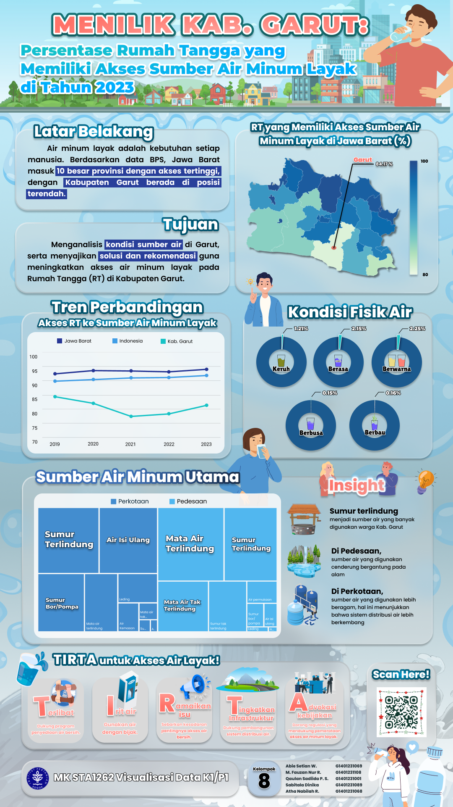

# Garut Drinking Water Access Infographic (2023)

An infographic project that communicates the condition of household drinking-water access in Garut using 2023 household survey data.

## Objective

- Describe household access to adequate drinking-water sources in Garut.
- Compare the trend with West Java and Indonesia.
- Explore the main drinking-water sources used in urban and rural areas.
- Summarize physical water conditions such as turbidity, taste, color, foam, and odor.
- Translate the findings into concise public-facing recommendations.

## Output

The final infographic combines a regional comparison map, historical trend, drinking-water source composition, physical-condition indicators, and recommendations for improving access to adequate drinking water.

## Files

| File | Description |
|---|---|
| [`infographic.png`](infographic.png) | Final infographic. |
| [`garut-drinking-water-access-2023.xlsx`](garut-drinking-water-access-2023.xlsx) | Supporting household-level and aggregated data used for the visualization. |
