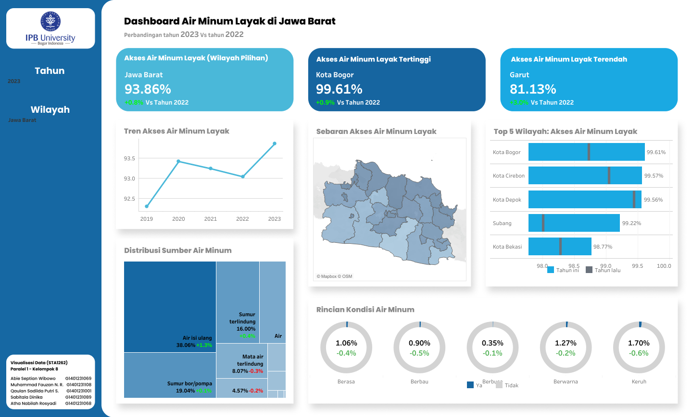

# West Java Drinking Water Access Dashboard

An interactive Tableau dashboard for exploring adequate drinking-water access across regencies and cities in West Java.

## Dashboard

[Open the interactive dashboard on Tableau Public](https://public.tableau.com/app/profile/muhammad.fauzan.nur.rasendriya/viz/DashboardAirMinumLayakdiJawaBarat/Dashboard?publish=yes)

## What the Dashboard Shows

- Trend of adequate drinking-water access over time.
- Regional distribution across West Java.
- Highest and lowest access levels by region.
- Distribution of drinking-water sources.
- Physical water-condition indicators.
- Comparison between the selected year and the previous year.

## Files

| File | Description |
|---|---|
| [`preview.png`](preview.png) | Static preview of the Tableau dashboard. |
| [`west-java-drinking-water-access.csv`](west-java-drinking-water-access.csv) | Regional drinking-water access percentages by year. |
| [`west-java-drinking-water-conditions.csv`](west-java-drinking-water-conditions.csv) | Physical-condition data by region, year, and urban/rural classification. |
| [`west-java-drinking-water-sources.csv`](west-java-drinking-water-sources.csv) | Drinking-water source distribution by region, year, and urban/rural classification. |
