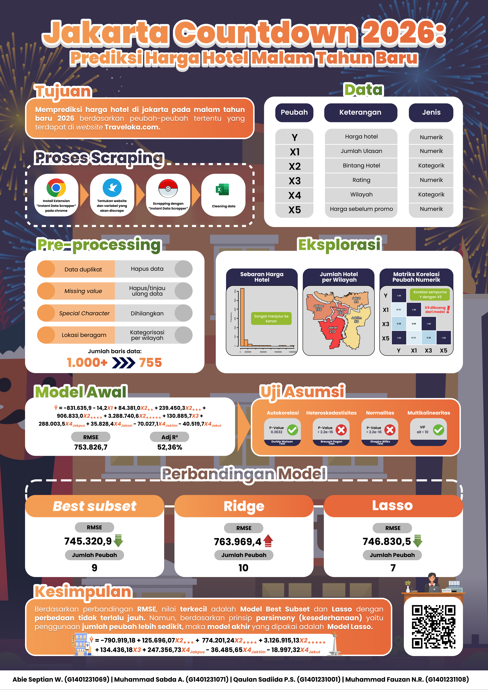

# Jakarta Hotel Price Prediction

A data science project for predicting Jakarta hotel prices on New Year's Eve using scraped hotel-listing data.

## Objective

Build an interpretable regression model for hotel prices using variables such as review count, star rating, customer rating, region, and pre-discount price.

## Workflow

- Data scraping and cleaning.
- Exploratory data analysis.
- Multiple linear regression.
- Multicollinearity and residual diagnostics.
- Variable selection using best subset selection.
- Regularization using Ridge and Lasso regression.
- Comparison of predictive error and model parsimony.

## Key Result

Best subset selection produced the lowest RMSE among the compared models, while Lasso achieved a very similar RMSE with fewer predictors. The final interpretation favors Lasso for its simpler model structure with competitive predictive performance.

## Files

| File | Description |
|---|---|
| [`jakarta-hotel-price-prediction.html`](jakarta-hotel-price-prediction.html) | Full rendered statistical analysis report. |
| [`jakarta-hotel-prices.csv`](jakarta-hotel-prices.csv) | Cleaned hotel dataset used in the analysis. |
| [`infographic.png`](infographic.png) | Final project infographic. |
