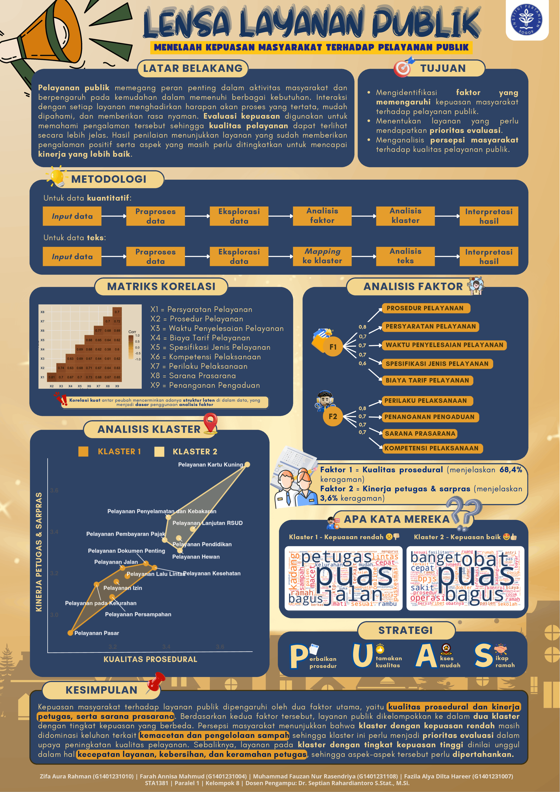

# Public Service Satisfaction Analysis

A mixed quantitative and text-analysis project examining how citizens evaluate public-service quality in an anonymized service-satisfaction survey.

## Objective

- Identify the main latent factors underlying public-service satisfaction.
- Group service types based on their satisfaction profiles.
- Explore open-ended complaints and suggestions to support interpretation of the quantitative results.

## Methods

### Quantitative Analysis

- Missing-value handling and exploratory analysis.
- Correlation analysis.
- Factor analysis to summarize related service-quality indicators.
- Hierarchical/K-means clustering to group service types with similar satisfaction patterns.

### Text Analysis

- Text cleaning and preprocessing.
- Mapping responses to service clusters.
- Frequency-based exploration and word-cloud-style summaries of complaints and suggestions.

## Main Insight

The project identifies procedural quality and staff/facility performance as important dimensions of satisfaction, then separates services into groups with different satisfaction patterns. Text responses are used to add context to the lower- and higher-satisfaction groups.

## Files

| File | Description |
|---|---|
| [`quantitative-analysis.html`](quantitative-analysis.html) | Rendered quantitative analysis report. |
| [`text-analysis.ipynb`](text-analysis.ipynb) | Notebook for preprocessing and analyzing open-ended survey responses. |
| [`public-service-satisfaction-survey.xlsx`](public-service-satisfaction-survey.xlsx) | Anonymized survey dataset. |
| [`infographic.png`](infographic.png) | Final project infographic summarizing the analysis. |

## Reproducibility Note

The text-analysis notebook preserves the original Google Colab/Drive workflow and may require path adjustments when rerun locally.
